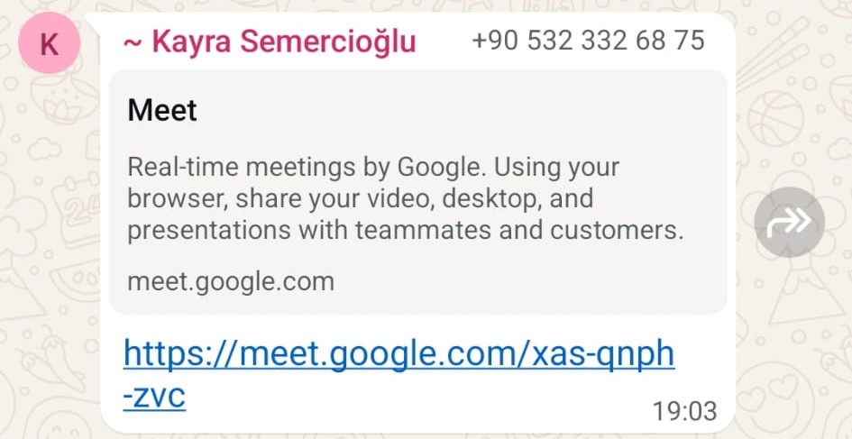
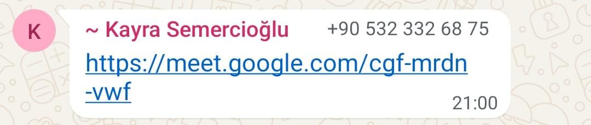
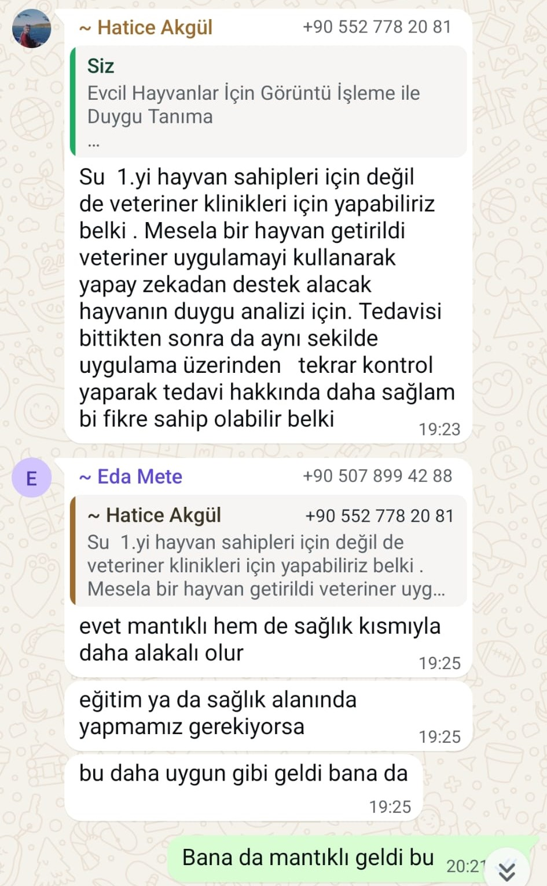
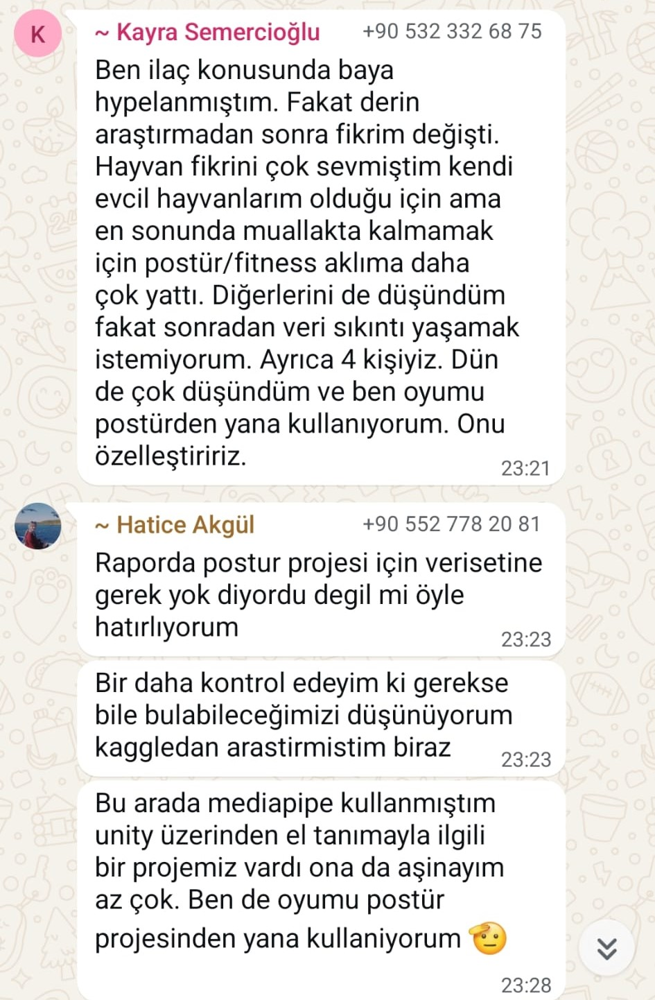
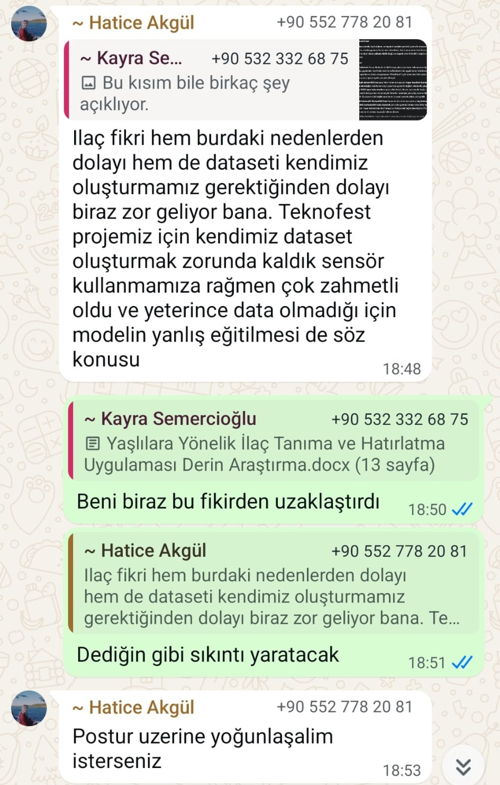

# Ürün İsmi

**TherapAI** – Gerçek Zamanlı Postür Analiz ve Duruş Takip Asistanı
---
# Ürün Logosu

---
| Fotoğraf         | İsim                     | Görevler             | LinkedIn Profili                          |  Durum |
| ---------------- | ------                   | -------------------- | ------------------------------------------| ----- |
|   | Hasan Barış Sunar        | Scrum Master         | [LinkedIn](https://www.linkedin.com/in/hasan-bar%C4%B1%C5%9F-sunar-48b26a174/) | Aktif |
|    | Kayra Semercioğlu        | Product Owner        | [LinkedIn](https://linkedin.com/in/ayse)  | Aktif |
|  | Hatice Aygül             | Developer            | [LinkedIn](https://www.linkedin.com/in/haticeeakg%C3%BCll?utm_source=share&utm_campaign=share_via&utm_content=profile&utm_medium=android_app )| Aktif |
|    | Eda Mete                 | Developer            | [LinkedIn](https://www.linkedin.com/in/edamete)| Aktif |
|     | Yusuf Yaşar              | Developer            | [LinkedIn](https://linkedin.com/in/can)   | Pasif |
---
 # Proje Açıklaması:

TherapAI, kullanıcıların duruşlarını gerçek zamanlı olarak analiz eden ve yanlış pozisyonlarda anında uyarı veren yenilikçi bir mobil sağlık uygulamasıdır. Uygulama, MediaPipe teknolojisi sayesinde vücuttaki iskelet noktalarını hassas şekilde tespit eder ve boyun, omuz, sırt ile bel açılarını temel geometrik yöntemlerle değerlendirir. Özellikle uzun süre masa başında çalışan bireylerde sıkça görülen duruş bozukluklarının önüne geçmeyi ve kullanıcıda ergonomik farkındalık oluşturmayı hedefler. Böylece TherapAI, daha sağlıklı bir yaşam ve iş ortamı için etkin bir destek sağlar.

---

 # Kullanılan Teknolojiler:

- **Yazılım Dili:** Python (AI Modülü), Dart (Flutter)

- **Geliştirme Ortamı:** Visual Studio Code

- **Mobil Geliştirme:** Flutter (Android ve iOS)

- **Yapay Zeka Çekirdeği:** MediaPipe Pose

- **Backend & Veritabanı:** Firebase (veri saklama, kullanıcı giriş/çıkış, analiz geçmişi)

- **Model Tipi:** Kurala dayalı duruş açısı sınıflandırma (geometrik açı hesabı)

---

# Hedef Kitle

- **Masa başında uzun süre çalışan beyaz yakalılar:**  
  Ofis ortamında bilgisayar başında çalışan bireylerde zamanla duruş bozuklukları gelişebilir. Uygulama, bu kişilere ergonomik farkındalık kazandırarak daha sağlıklı bir çalışma düzeni oluşturmayı hedefler.

- **Öğrenciler:**  
  Özellikle çevrim içi eğitim sürecinde uzun süre oturan öğrencilerde yaygın görülen kambur duruş ve baş öne eğik pozisyon gibi postür sorunlarının önüne geçmek için tasarlanmıştır.

- **Fizyoterapi desteği alan bireyler:**  
  Rehabilitasyon sürecinde olan veya sırt, boyun ve bel ağrısı yaşayan bireyler, PostuRek aracılığıyla evde kendi duruşlarını izleyip düzeltici geri bildirimler alabilir.

- **Spor yapanlar / Fitness kullanıcıları (Gym):**  
  Egzersiz sırasında doğru postür hayati önem taşır. Uygulama, spor esnasında yapılan hareketlerde omurga ve duruş pozisyonlarının korunmasına yardımcı olabilir. Özellikle ağırlık çalışmaları sırasında omuz ve bel hizasının korunması için anlık uyarılar sunabilir.

- **Genel kullanıcılar:**  
  Günlük yaşamda daha sağlıklı ve estetik bir duruşa sahip olmak isteyen herkes, PostuRek’i bir rehber olarak kullanabilir.

---

# Ürün Özellikleri

- **Kameradan gerçek zamanlı duruş tespiti:**  
  Cihaz kamerası aracılığıyla kullanıcının vücut duruşu analiz edilir. MediaPipe teknolojisi ile omuz, boyun ve bel hizası gibi kritik noktalar gerçek zamanlı takip edilir.

- **Kötü postür algılandığında anlık uyarı bildirimi:**  
  Tanımlanan açı limitleri dışına çıkıldığında kullanıcıya görsel veya sesli uyarılar gönderilir. Bu sayede kullanıcı farkında olmadan yaptığı duruş hatalarını anında düzeltebilir.

- **Kullanıcıya günlük rapor sunumu:**  
  Gün içinde ne kadar süre doğru ya da yanlış postürde durulduğu gibi bilgiler analiz edilerek kullanıcıya sade bir rapor halinde sunulur.

- **Firebase ile bulut tabanlı kullanıcı geçmişi saklama:**  
  Kullanıcıların duruş analiz geçmişi, Firebase veritabanı üzerinden güvenli bir şekilde saklanır. Bu veriler daha sonra istatistiksel takip ve ilerleme değerlendirmesi için kullanılabilir.

- **Mobil arayüz ile kolay kullanım:**  
  Flutter ile geliştirilen kullanıcı arayüzü; hem Android hem de iOS cihazlarda tutarlı ve yüksek performanslı bir deneyim sunacak şekilde tasarlanmıştır. Temiz, sezgisel ve responsive ekranlar sayesinde kullanıcı dostu bir kullanım sağlar.

- **Kullanıcı dostu, minimal tasarım:**  
  Gereksiz karmaşadan uzak, sade ve modern bir arayüz sunularak uygulamanın hem estetik hem de fonksiyonel olması hedeflenmiştir.

---

**Product Backlog URL**

Product backlog’u Trello üzerinde yönetiyoruz.  
Trello panosuna erişim için [URL buraya eklenecek].

---

  
<strong> SPRİNT 1 </strong>

###  Sprint 1 - Planlama ve Teknoloji Kararları

####  Sprint Notları  
- Proje kapsamında kullanılacak ana teknolojiler belirlendi:  
 - Yapay Zeka için MediaPipe Pose  
 - Mobil uygulama geliştirme için Flutter (Dart)
- Backend ve veri saklama için Firebase  
- Proje hedefleri ve öncelikli modüller üzerinde ekip içinde fikir birliğine varıldı.  
- Uygulamanın temel işlevleri, kullanıcı ihtiyaçları ve teknik gereksinimler detaylandırıldı.  
- Hangi modüllere öncelik verileceği ve sprint sonu hedefleri netleştirildi.

---

####  Sprint Puanlaması (Toplam 200 Puan)

Proje toplamda 200 puan üzerinden değerlendirilecektir.

###  Sprint İçerisinde Tamamlanması Gereken 50 Puan

Sprint 1, projenin planlama, temel altyapı ve teknoloji seçim aşamalarını kapsar.  
Bu sprintin başarıyla tamamlanması için toplam 50 puan alınması hedeflenmiştir.

####  Planlanan Ana Görevler ve Puanlama 
-  Teknoloji araştırması ve seçimi (15 puan)  
-  Proje mimarisi ve veri akışının tasarlanması (15 puan)  
-  Kullanıcı ihtiyaçları ve önceliklerin belirlenmesi (10 puan)  
-  UI/UX için ilk fikirlerin toplanması ve eskizler (10 puan)  

#### Sprint 1 Sonuç:
- **Hedeflenen Puan:** 50  
- **Gerçekleşen Puan:** **45** (Firebase giriş sistemi altyapısı testleri tamamlanmadığı için 5 puan düşülmüştür)
---

####  Daily Scrum  
- Günlük toplantılar **WhatsApp** ve **Google Meet** üzerinden gerçekleştirilmiştir.  
- Toplantı notları ve tartışmalar **Konuşma ve Toplantı Kayıtları** üzerinde paylaşılmıştır.
 

<strong> Konuşma ve Toplantı Kayıtları</strong>

 

   
  <em>Toplantı 1</em>

   
  <em>Toplantı 2</em>

   
  <em>Whatsapp Görüşmeleri</em>

   
  <em>Whatsapp Görüşmeleri</em>

   
  <em>Whatsapp Görüşmeleri</em>

---

####  Sprint Review (Planlama Sonrası)  
- Ana teknolojiler ve araçlar seçildi.  
- Proje hedefleri ekipçe netleştirildi ve görev dağılımı yapıldı.  
- İlk UI/UX fikirleri toplandı ve ön taslaklar oluşturuldu.  
- Veri modeli ve temel mimari için ilk yol haritası çizildi.

---

####  Sprint Retrospective  
- Planlama aşaması verimli geçti, ekip üyeleri teknoloji seçiminde hem fikir oldu.  
- Bazı modüller için daha detaylı araştırma gerekliliği ortaya çıktı.  
- İletişim ve koordinasyonun artırılması konusunda fikirler oluştu.  
- Bir sonraki sprintte kodlama ve prototip geliştirme aşamasına geçilecek.

---

